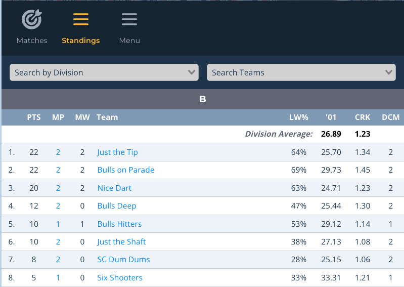
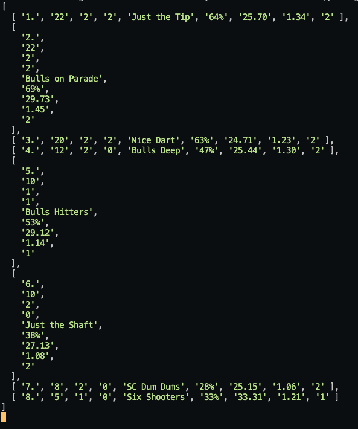

# Dart Connect Web Scrapper

##### A web-based app to scrape league standings from Dart Connect's public league standings page.

## :camera_flash: Screenshots

|             Description              | Screenshot                                    |
| :----------------------------------: | --------------------------------------------- |
| <h3 align="center">DC Standings</h3> |  |
| <h3 align="center">Data Output</h3>  |  |

## How to Run

#### First Things First

- Be sure to run 'npm i' to download all dependencies needed.
- You will need to adjust the size of your array based on the number of teams in your league (line 24 - app.js)
- Be sure to update your MongoDB url if you wish to save the data that you've scraped. 

